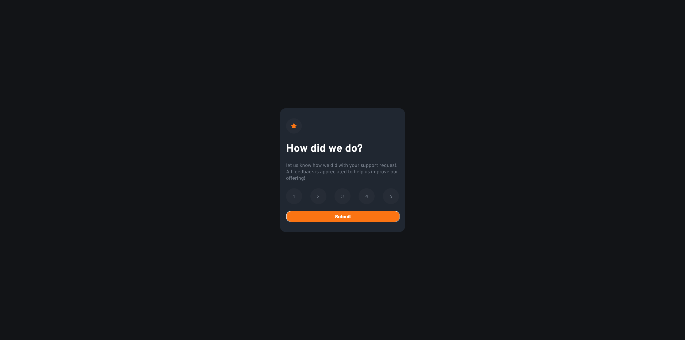

# Frontend Mentor - Interactive rating component solution

This is a solution to the [Interactive rating component challenge on Frontend Mentor](https://www.frontendmentor.io/challenges/interactive-rating-component-koxpeBUmI). Frontend Mentor challenges help you improve your coding skills by building realistic projects.

## Table of contents

- [Overview](#overview)
  - [The challenge](#the-challenge)
  - [Screenshot](#screenshot)
  - [Links](#links)
- [My process](#my-process)
  - [Built with](#built-with)
  - [What I learned](#what-i-learned)

**Note: Delete this note and update the table of contents based on what sections you keep.**

## Overview

### The challenge

Users should be able to:

- View the optimal layout for the app depending on their device's screen size
- See hover states for all interactive elements on the page
- Select and submit a number rating
- See the "Thank you" card state after submitting a rating

### Screenshot

Screen Shoot of desktop view of my solution rating screen

Screen Shoot of desktop view of my solution thank you screen

### Links

- Solution URL: [solution URL here](https://your-solution-url.com)
- Live Site URL: [live site URL here](https://peterjgalvan.github.io/Interactive-Rating-Component-Static-Frontend-Mentor/)

## My process

### Built with

- Semantic HTML5 markup
- Flexbox
- Mobile-first workflow
- Google Fonts
- JavaScript

### What I learned

I learned how to code based on provided design sketch. That a designer would provide to frontend developer in a real life scenario and how to meet those standards. I also got to work with and use sessionStorage in my JavaScript.
